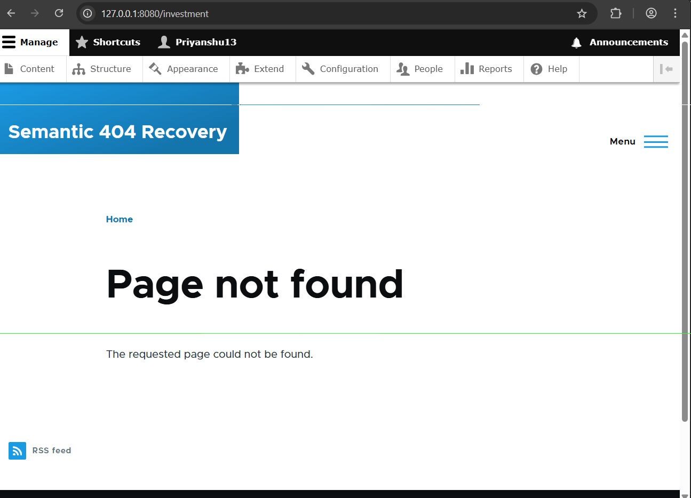
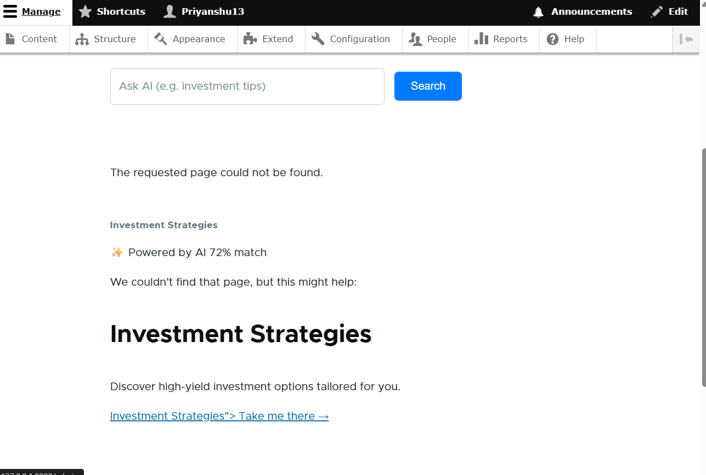

# Semantic 404 Recovery & AI Search

**Semantic 404 Recovery** is a decoupled Drupal module that replaces the standard "Page Not Found" message with an intelligent, AI-driven "Did you mean?" suggestion card. It also includes an **AI Semantic Search** block that allows users to seamlessly search for matching content natively within the Drupal UI.

By connecting to a Python-based FastAPI Vector Engine (or any external matching service), this module ensures that broken links and search queries intuitively point users to the most relevant content available on your site.

---

## 🚀 Features

- **Smart 404 Suggestions**: Automatically intercepts 404 errors and fetches high-confidence matches from the AI Engine.
- **Interactive AI Search Block**: A dedicated search input that queries the AI Engine and displays context-aware results instantly.
- **Modern Fintech Aesthetics**: Results are rendered using a sleek, modern UI card template.
- **Decoupled Architecture**: Communicates via REST with an external Python/FastAPI semantic similarity engine.
- **High Performance**: Caches 404 results and search queries to minimize redundant AI Engine calls.

---

## 📸 Before and After

Below is a visual representation of how this module transforms the user experience on broken URLs:

### Output without the module installed:
When a user visits a broken link, they hit a generic, unhelpful dead end.



### Output with the module installed:
When a user visits a broken link, the AI kicks in and suggests the most semantically relevant alternative, fully integrated into the Drupal theme.



---

## 🛠️ Requirements

- **Drupal 10+**
- **PHP 8.1+**
- **Guzzle HTTP Client** (Included in Drupal core)
- A running instance of the **FastAPI AI Engine** on `localhost:8000` (or configured externally).

---

## 📦 Installation

1. Copy the `semantic_404` directory into your Drupal installation under `web/modules/custom/`.
2. Ensure your Python backend (AI Engine) is running (typically via `uvicorn main:app --port 8000`).
3. Enable the module inside Drupal:
   - Navigate to **Extend** in the Admin toolbar.
   - Search for **Semantic 404 Recovery**.
   - Check the box and click **Install**.
   - Alternatively, install via Drush: `drush en semantic_404 -y`

---

## ⚙️ Configuration & Setup

Once the module is installed, you must tell your Drupal theme where to display the AI blocks!

1. Go to **Structure** -> **Block layout** in the Administration menu.
2. Scroll to the **Content** region (or wherever you prefer main content to render) and click **Place block**.
3. **Add the 404 Recovery Block:**
   - Search for **Semantic 404 Suggestion**.
   - Click **Place block**.
   - *(Optional)* Under "Visibility", you can restrict it to only show on 404 routes, though the block logic is smart enough to stay hidden normally.
4. **Add the AI Search UI Block:**
   - Search for **AI Semantic Search**.
   - Click **Place block**.
   - This block will output a sleek search bar that queries your AI engine without leaving the page.
5. Click **Save blocks** at the bottom of the layout page.

---

## 📡 AI Engine Settings (Optional)

By default, the module attempts to communicate with `http://127.0.0.1:8000`. 
To override this (e.g., if deploying to production):
- Navigate to **Configuration** -> **Web services** -> **Semantic 404 Settings** *(if implemented)*.
- Or, use Drush to update the config dynamically:
  ```bash
  drush config:set semantic_404.settings ai_engine_url "https://my-production-ai.example.com"
  ```

---

## 🧩 Architecture Details

* **`Smart404SuggestionBlock.php`**: Evaluates the current path parameter against the backend `/match` API. If the similarity score exceeds `50%`, it renders a suggestion card.
* **`AiSearchBlock.php`**: Outputs an interactive HTML form. When an `ai_query` parameter is passed, it displays the AI's top matched snippet dynamically.
* **`SemanticMatcher.php`**: The HTTP client wrapper that manages timeout safety, error logging, and standardizing JSON responses.
* **`semantic-404-card.html.twig`**: The styling template ensuring everything feels native and responsive.

Enjoy better user retention and a smarter ecosystem with Semantic 404!
